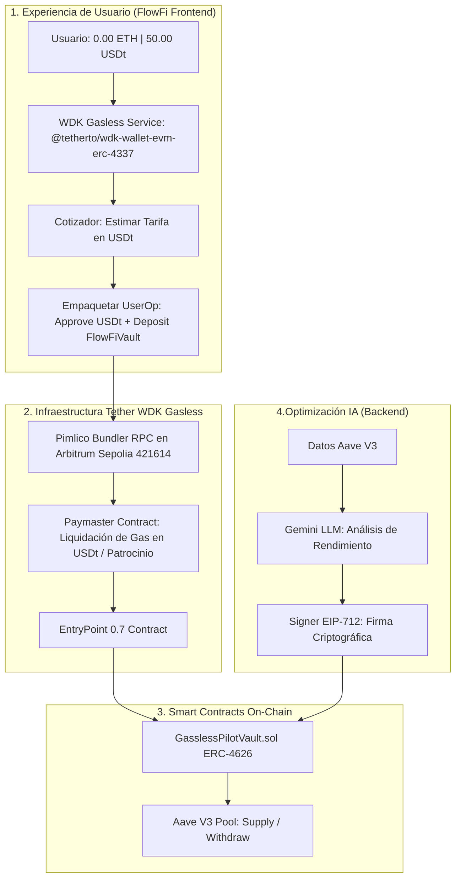

# FlowFi — Tether WDK Gasless & AI DeFi Vault en Arbitrum

> **Bóveda ERC-4626 en Arbitrum que ofrece Onboarding sin Gas (Tether WDK Pista 2 - Gasless): un usuario nuevo llega con 0.00 ETH y deposita directamente en USD₮ mediante Smart Accounts ERC-4337 con gas pagado en USD₮ o patrocinado por Paymaster, mientras un motor de IA optimiza el rendimiento en Aave V3 con verificación criptográfica EIP-712.**

---

##  Pistas y Categorías del Hackathon 2026

* **🟧 Patrocinador — Tether WDK (Pista 2: Construir algo sin gas / Gasless):**
  * Integración nativa del módulo oficial **`@tetherto/wdk-wallet-evm-erc-4337`** y **`@tetherto/wdk`**.
  * **Zero-to-first-deposit onboarding**: Un usuario llega con una billetera vacía (0.00 ETH, 0 USD₮), recibe USD₮ de prueba en la demo, y deposita directamente en la bóveda **sin haber comprado ETH nativo nunca**.
  * **Cotización en USD₮ pre-firma**: Se calcula y muestra la tarifa estimada en USD₮ antes de la transacción.
  * **Empaquetado atómico (Batching)**: Se agrupan `approve` y `deposit` en una sola `UserOperation` procesada por Pimlico Paymaster en Arbitrum Sepolia.
* **Categoría General:** IA – Blockchain (Arbitrum DeFi & Smart Contracts).

---

## 🔗 Permalinks Directos a la Integración de Tether WDK

> **Para revisión directa de los jueces de Tether:**

1. **Servicio WDK Gasless & Paymaster:** [`client/src/services/wdkGaslessService.ts`](client/src/services/wdkGaslessService.ts)
   * Inicialización de `WalletManagerEvmErc4337` con Pimlico Paymaster RPC (`Arbitrum Sepolia`).
   * Cotizador de tarifas en USD₮: `quoteDeposit(amountUsdt)`.
   * Batching atómico de llamada `approve` + `deposit`: `executeGaslessDeposit(amountUsdt)`.
2. **Interfaz de Onboarding Sin Gas:** [`client/src/components/VaultView.tsx`](client/src/components/VaultView.tsx)
   * Toggle de Smart Account ERC-4337, panel de saldo dual (0 ETH / USD₮), estimador de comisiones y botón de depósito gasless.
3. **Configuración de Variables de Entorno:** [`client/.env.example`](client/.env.example)

---

## Demo y Enlaces Oficiales

* **Frontend:** [https://]()
* **Backend API / Agente IA:** [https://]()
* **Contrato GasslessPilotVault en Arbitrum Sepolia:** [`0x9b24ADD6fe458f1d620A17ceC8d20944C37296d7`](https://sepolia.arbiscan.io/address/0x9b24ADD6fe458f1d620A17ceC8d20944C37296d7#code)
* **Pimlico Bundler & Paymaster (Arbitrum Sepolia):** `https://api.pimlico.io/v2/421614/rpc?apikey=...`
* **Video Demo (Async):** *[Enlace al video demo asíncrono]*

---

## El Problema y la Solución

### El Problema
1. **Fricción de Gas en Onboarding:** Un usuario nuevo que tiene USD₮ pero no ETH nativo no puede interactuar con DeFi. Debe ir a un exchange, comprar ETH, pagar comisiones de retiro y enviarlo a su wallet solo para pagar centavos de gas.
2. **Complejidad de Gestión en DeFi:** Monitorear tasas variables de Aave V3 24/7 y calcular cuándo vale la pena rebalancear.

### La Solución: FlowFi
1. **Onboarding Gasless con Tether WDK:** La dApp instancia una Smart Account ERC-4337 no custodial (`@tetherto/wdk-wallet-evm-erc-4337`). El usuario puede recibir USD₮ y depositar inmediatamente en el vault sin tener ETH.
2. **Batching de Transacciones:** En lugar de 2 firmas separadas (`approve` luego `deposit`), WDK agrupa ambas llamadas en una sola `UserOperation`.
3. **Optimización con IA de Dos Capas:**
   * *Capa 1:* Monitoreo cuantitativo continuo de gas y tasas en Aave V3.
   * *Capa 2 (Gemini LLM):* Razonamiento contextual de riesgo y firma criptográfica **EIP-712** para rebalanceo on-chain.
4. **Liquidez Just-In-Time:** El usuario puede retirar en cualquier momento sin riesgo de fondos bloqueados.

---

##  Arquitectura de FlowFi



---

## Guía de Inicio Rápido (Setup desde cero)

### Prerrequisitos
* Node.js >= 22.18.0
* Python 3.10+

### 1. Clonar e Instalar Frontend
```bash
cd client
npm install
cp .env.example .env
npm run dev
```

### 2. Variables de Entorno del Cliente (`client/.env`)
```env
VITE_PIMLICO_RPC_URL=https://api.pimlico.io/v2/421614/rpc?apikey=TU_PIMLICO_API_KEY
VITE_VAULT_CONTRACT_ADDRESS=0x9b24ADD6fe458f1d620A17ceC8d20944C37296d7
VITE_USDC_CONTRACT_ADDRESS=0x75faf114eafb1BDbe2F0316DF893fd58CE46AA4d
VITE_CHAIN_ID=421614
VITE_API_URL=http://localhost:8000
```


### 3. Ejecutar Backend de IA
```bash
cd server
pip install -r requirements.txt
python -m uvicorn app.main:app --reload --port 8000
```

---

## 👥 Equipo y Roles

* **Jesús Alfaro:** Smart Contracts (ERC-4626, Aave V3, EIP-712 Verification & Foundry Tests en Arbitrum Sepolia).
* **Dante Olivas:** Integración Tether WDK Gasless (ERC-4337 & Pimlico Paymaster), Frontend React, Backend FastAPI con Gemini LLM y Arquitectura de Producto.
